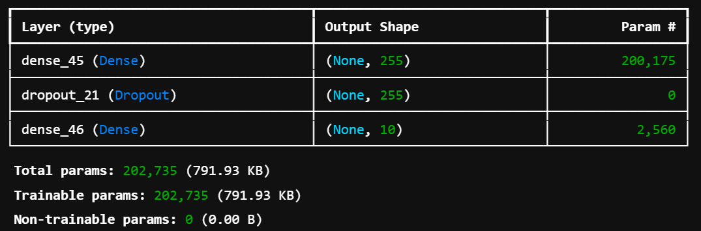
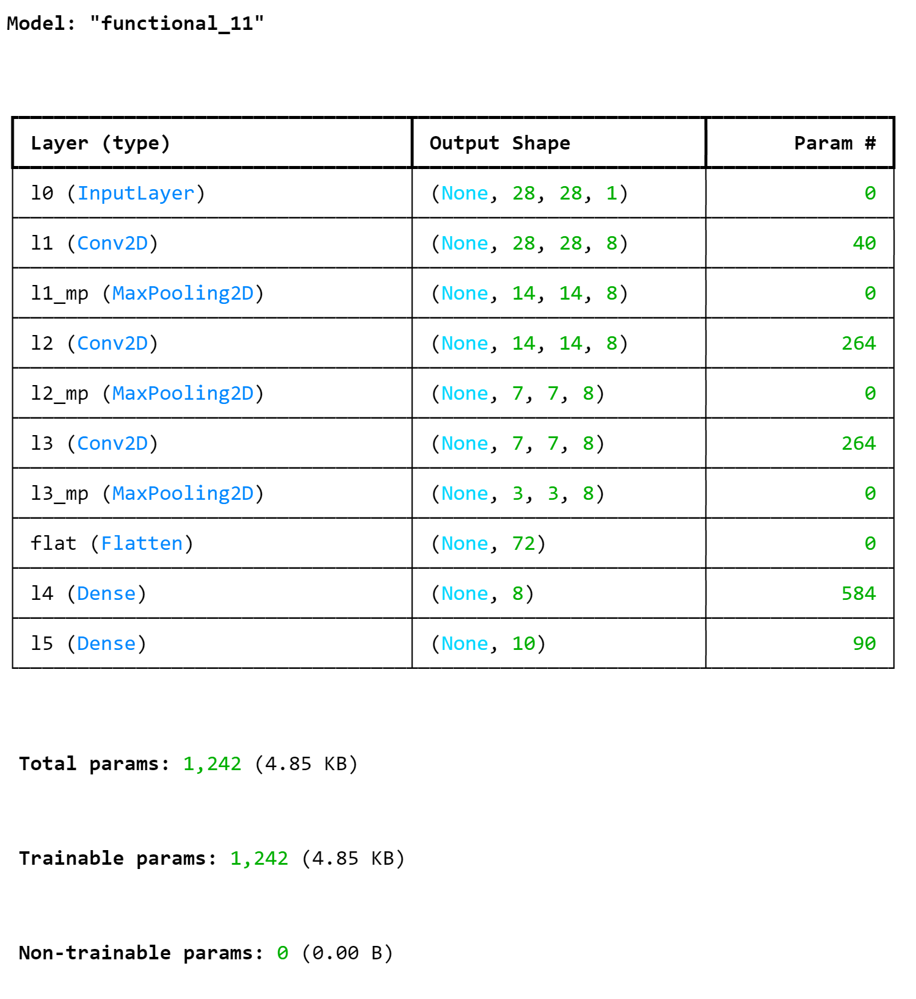
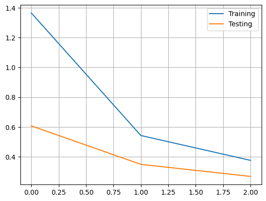
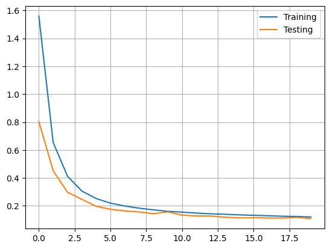
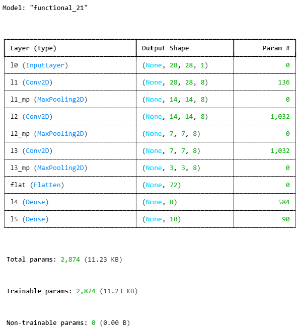
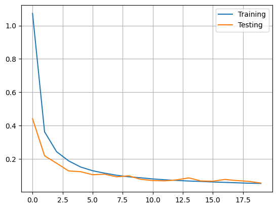
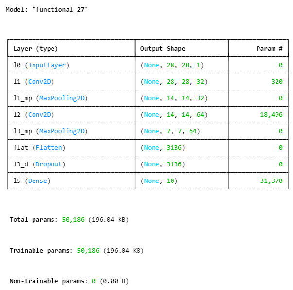
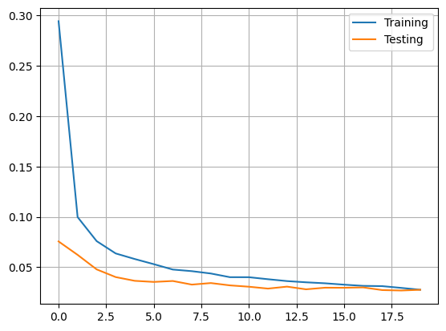

# **Deep neural networks**
# **Practical work #04**

**Class : Artificial Neural Network ARN**<br>
**Professor :** Andres Perez-Uribe <br>
**Assistants :** Shabnam Ataee, Simon Walther <br>
**Students :** Julien Mühlemann, Lucas Lattion


dernière partie:
```
- ne pas chercher à améliorer le F1
- mentionner que le set de validation ne dispose que de 18 observations et donc qu'à chaque déviation
la validation est instable. (explication des graphes en dents de scie)
```
## Introduction


## Overall description

# TODO control the responses and reformat everything !!!!!!


> What is the learning algorithm being used to optimize the weights of the neural networks?

The learning algorithm used in the various experiences are :

Notebook A
Learning Algorithm: Stochastic Gradient Descent (SGD)
A commonly used optimization algorithm for training neural networks. It updates the model's weights by computing gradients of the loss function with respect to the weights and then applying a step in the opposite direction.

Notebook B
Learning Algorithm: Adam (Adaptive Moment Estimation)
Adam combines the benefits of Adaptive Gradient Algorithm (AdaGrad) and Root Mean Square Propagation (RMSProp). It uses adaptive learning rates and momentum to optimize the weights, resulting in faster convergence.

Notebook C
Learning Algorithm: RMSProp
RMSProp is an adaptive learning algorithm that adjusts the learning rate based on the average of recent gradients. This helps to mitigate the oscillations and stabilizes the training process.

> What are the parameters (arguments) being used by that algorithm?

The following parameters had been used for each algorithms :


Notebook A
RMSprop Parameters
lr (Learning Rate): Controls the size of the steps taken during optimization. Commonly between 0.001 and 0.01.
rho: Decay rate for the moving average of squared gradients. Usually around 0.9.
eps (Epsilon): Small constant to avoid division by zero; typically 1e-8 or similar.
weight_decay: Regularization parameter; often 0 or a small value like 1e-4.
momentum: Adds momentum to the optimizer; typical values are 0 or 0.9.
Loss Function
Cross-Entropy Loss: Typically used for classification tasks. Measures dissimilarity between predicted output and actual target.


Notebook B
RMSprop Parameters
Similar to Notebook A, with some variations:
lr: Typically 0.001 to 0.01.
rho: Generally 0.9.
eps: Around 1e-8.
weight_decay: Often 0 or another small value.
momentum: Typically 0 or 0.9.
Loss Function
If dealing with a regression task, a common choice is:
Mean Squared Error (MSE): Calculates the average of squared differences between predicted and actual values.


Notebook C
RMSprop Parameters
Usually consistent with A and B, with possible variations for specific tasks:
lr: Often between 0.001 and 0.01.
rho: Generally around 0.9.
eps: Usually 1e-8 or similar.
weight_decay: Typically 0.
momentum: Often 0.
Loss Function
In mixed tasks or where outliers are a concern, a common choice is:
Huber Loss: A combination of MSE and Mean Absolute Error (MAE), providing robustness to outliers with smoother gradients.


> What loss function is being used ?

The loss functions are the following :
Notebook A
Loss Function: Cross-Entropy Loss
This loss function is typically used for classification tasks. It measures the difference between predicted class probabilities and the actual class labels.

Notebook B
Loss Function: Mean Squared Error (MSE)
This loss function is commonly used for regression tasks. It calculates the average of the squared differences between the predicted values and the actual target values.

Notebook C
Loss Function: Huber Loss
This loss function is a combination of Mean Squared Error (MSE) and Mean Absolute Error (MAE). It is robust to outliers while maintaining smooth gradients for optimization.

> Please, give the equation(s)

* Notebook A: Stochastic Gradient Descent (SGD)
$\\w_{t+1} = w_t - \eta \cdot \nabla L(w_t)\\$

* Notebook B: Adam (Adaptive Moment Estimation)

Update biased first moment (mean) and second moment (uncentered variance) estimates
$\\\begin{align}
m_{t+1} = \beta_1 \cdot m_t + (1 - \beta_1) \cdot g_t
\end{align}\\$

$\\\begin{align}
v_{t+1} = \beta_2 \cdot v_t + (1 - \beta_2) \cdot g_t^2
\end{align}\\$

Compute bias-corrected first and second moment estimates
$\\\begin{align}
\hat{m}_{t+1} = \frac{m_{t+1}}{1 - \beta_1^{t+1}}
\end{align}\\$

$\\\begin{align}
\hat{v}_{t+1} = \frac{v_{t+1}}{1 - \beta_2^{t+1}}
\end{align}\\$

Update weights
$\\\begin{align}
w_{t+1} = w_t - \eta \cdot \frac{\hat{m}_{t+1}}{(\sqrt{\hat{v}_{t+1}} + \epsilon)}
\end{align}\\$

* Notebook C: RMSProp

Update squared gradients' moving average
$\\\begin{align}
v_{t+1} = \beta \cdot v_t + (1 - \beta) \cdot g_t^2
\end{align}\\$

Update weights
$\\\begin{align}
w_{t+1} = w_t - \eta \cdot \frac{g_t}{\sqrt{v_{t+1}} + \epsilon}
\end{align}\\$


## Shallow network learning from raw data

> Neural network topology (architecture) :

The inputs in our neural network are each of the pixels of the MNNIST dataset I.E. 28*28 = 784 entry neurons.

We have 60k entries for the train set and 10k for the test set. Each record are split into 10 classes. Each of them being a representation of a digit 0 to 9.

The dataset seems to be relatively well balanced. We have min 5421 items for the less represented class (digit 5) and 6742 item for the most represented (digit 1)

> Number of weights :

We have 784 input neurons
We have 255 neurons in the hidden layer
We have 10 output nuerons

We multiply 784 * 255 + 255 (for each biais) = 200 655
We have 255 * 10 + 10(for each biais) = 2560
Then add them up = 200 655 + 2560 = 203 215 weights overall

> Test of different cases :

After several experiments we decided to go for the following topology with a _relu_ activation on the output layer:


This topology allows us to reach an accuracy of about 98.3%

We tested with :

    - no dropout layer  -> 98 %
    - with 300 neurons in the hidden layer -> 97.8 %
    - with dropout 0.3 -> 98 %
    - with tanh activation on the output layer -> 97.7 %
    - with 240 neurons in the hidden layer -> 98.2 %

Those trials showed us that here, the simpler the architecture is the better it performs.


> analysis of this shallow network from raw data :


### Shallow network from features of the input data

> Neural network topology (architecture) :


> Number of weights :


> Test of different cases :


> analysis of this shallow network from features :


### CNN neural network for digit recognition

> Neural network topology (architecture) :
Initial architecture
<div style="text-align:center">
    
</div>


> Number of weights : 
- 1'242 in initial architecture
- 2'874 in the third test architecture
- 50'186 in the fourth test architecture

> Test of different cases :


1. Add neurones on all the layers from 2 to 8 neurones:

```
Test score: 0.31283387541770935
Test accuracy: 0.9063000082969666
```


```
array([[ 952,    1,    2,    1,    3,    0,   14,    1,    6,    0],
       [   0, 1120,    6,    1,    1,    0,    4,    1,    2,    0],
       [  25,    2,  940,   10,    6,    1,   23,   12,   13,    0],
       [   0,    0,   21,  931,    0,   11,    7,   10,   24,    6],
       [   2,    6,    6,    0,  908,    0,   10,    8,    1,   41],
       [   3,    0,    2,   63,    4,  690,    6,    1,  105,   18],
       [  33,    9,    8,    0,    9,    2,  866,    0,   26,    5],
       [   0,   11,   12,    1,    9,    0,    3,  975,    2,   15],
       [  57,   11,   16,   20,    3,   12,   18,   18,  784,   35],
       [   2,   10,    0,    6,   22,    8,   11,   32,   21,  897]],
      dtype=int64)
```

2. Change number of Epoch from 3 to 20

```
Test score: 0.10416335612535477
Test accuracy: 0.9656000137329102
```


```
array([[ 972,    0,    3,    0,    0,    0,    3,    1,    1,    0],
       [   0, 1108,   12,    0,    1,    1,    2,    3,    8,    0],
       [   5,    3,  999,    3,    3,    0,    0,   11,    7,    1],
       [   0,    0,   13,  962,    0,   18,    0,    7,    8,    2],
       [   0,    1,    2,    0,  962,    0,    5,    1,    1,   10],
       [   1,    0,    0,   12,    0,  843,    8,    0,   19,    9],
       [  10,    1,    3,    0,    2,    1,  937,    0,    4,    0],
       [   3,    5,    6,    2,    2,    0,    0,  994,    3,   13],
       [  19,    0,    6,    0,    5,    3,    4,    9,  919,    9],
       [   2,    2,    2,    0,   19,    7,    2,   10,    5,  960]],
      dtype=int64)
```

3. Change size of convolution matrix from 2x2 to 3x3, 4x4, 5x5

<div style="text-align:center">
    
</div>


```
Test score: 0.04813019186258316
Test accuracy: 0.9842000007629395
```

<div style="text-align:center">
    
</div>


```
array([[ 908,    0,    5,    4,    5,    8,   29,    2,   18,    1],
       [   1, 1111,    7,    2,    1,    0,    6,    0,    7,    0],
       [   9,    2,  867,   75,   11,    7,    3,    9,   47,    2],
       [   4,    0,   33,  853,    3,   16,    1,    8,   80,   12],
       [   2,    8,    3,    1,  894,    0,   15,    5,   23,   31],
       [  11,    4,   15,  198,   16,  498,   23,   13,  107,    7],
       [  11,    4,    0,    0,   15,    4,  880,    3,   41,    0],
       [   2,    8,   20,   11,   31,    3,    0,  854,   17,   82],
       [   9,    3,    8,   20,   21,   12,   27,    3,  857,   14],
       [   6,    3,    5,   21,   80,    1,    1,   32,   39,  821]],
      dtype=int64)
```

4. Additional tests

To gain up accuracy to 99% we did many small change like adding neurones, adding a dropout and also changing convolution matrix.

<div style="text-align:center">
    
</div>


```
Test score: 0.02048155479133129
Test accuracy: 0.9937000274658203
```

<div style="text-align:center">
    
</div>

```
array([[ 978,    0,    0,    1,    0,    0,    0,    0,    1,    0],
       [   0, 1131,    2,    1,    0,    0,    1,    0,    0,    0],
       [   1,    0, 1028,    0,    0,    0,    0,    3,    0,    0],
       [   0,    0,    1, 1008,    0,    1,    0,    0,    0,    0],
       [   0,    0,    0,    0,  978,    0,    1,    0,    1,    2],
       [   1,    0,    0,    5,    0,  885,    1,    0,    0,    0],
       [   3,    2,    0,    1,    1,    3,  946,    0,    2,    0],
       [   0,    1,    5,    0,    0,    0,    0, 1021,    1,    0],
       [   2,    0,    2,    1,    1,    1,    0,    1,  963,    3],
       [   0,    0,    0,    1,    3,    2,    0,    2,    2,  999]],
      dtype=int64)
```


> analysis of this CNN for digit recognition :

The CNN achieved a test score of 0.0205 and a test accuracy of 0.9937, indicating exceptional performance in digit recognition. The network architecture consists of two convolutional layers followed by max-pooling layers to extract features from input images. The features are then flattened and processed through a dropout layer to prevent overfitting. Finally, a dense layer with 10 neurons is utilized for classification. With a total of 50,186 parameters, the model demonstrates both high accuracy and efficiency in parameter usage, showcasing its effectiveness in recognizing digits from images.

## CNN and their weights

> The CNNs models are deeper (have more layers), do they have more weights than the
> shallow ones? explain with one example.

To obtain an equivalent performance score the normal MLP needed much more neurones, so much more weight compaired to the CNN model.

Example: 
- Our CNN model in test number 3, obtain a score of 98% accuracy with less than 3'000 weights.
- With the MLP raw data we get a lower score of 97% with more than 200'000 weights.

## CNN for chest X-ray pneumonia recognition

> Train a CNN for the chest x-ray pneumonia recognition. In order to do so, complete the
> code to reproduce the architecture plotted in the notebook. Present the confusion matrix,
> accuracy and F1-score of the validation and test datasets and discuss your results.