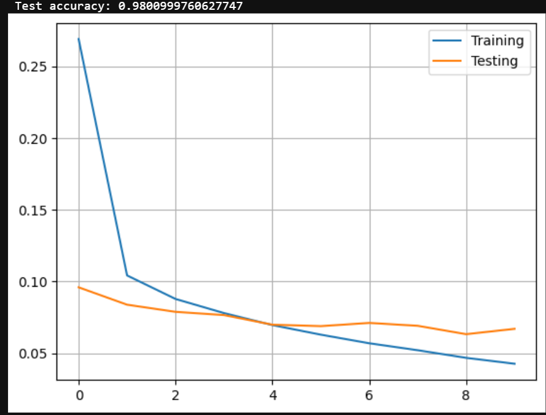
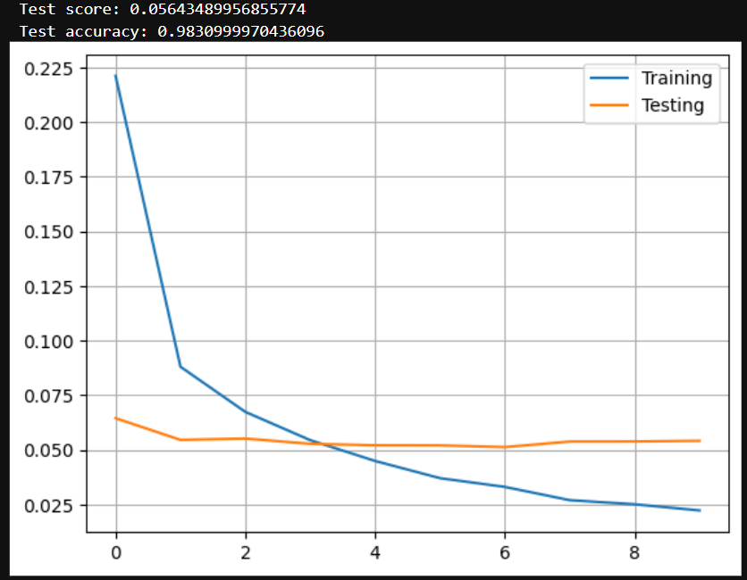

# **Deep neural networks**
# **Practical work #4**

**Class : Artificial Neural Network ARN**<br>
**Professor :** Andres Perez-Uribe <br>
**Assistants :** Shabnam Ataee, Simon Walther <br>
**Students :** Julien Mühlemann, Lucas Lattion


## Introduction


In this practical work, we explore various neural network architectures and learning algorithms to address digit recognition and pneumonia detection from chest X-rays. We use the MNIST dataset for digit classification and a CNN for chest X-ray pneumonia recognition. RMSprop is chosen as the optimization algorithm, and categorical cross-entropy is used as the loss function. Through multiple experiments, we analyze the impact of network architecture on performance and evaluate the results through confusion matrices, accuracy, and F1-scores.


## Overall description


> What is the learning algorithm being used to optimize the weights of the neural networks?

The learning algorithm used in all three experiences is root mean square propagation (RMSprop) :

An adaptive learning rate optimizer. It maintains a moving average of the squares of gradients and adjusts the learning rate accordingly. This helps prevent large gradients from causing instability during training. It handles noisy gradients well and according to our researches it can converge faster than stochastic gradient descent. Performs well on complex dataset may be interesting for the pneumonia dataset.

> What are the parameters (arguments) being used by that algorithm?

The following parameters are being used by the RMSprop algorithm :

- learning_rate: Determines the size of the step taken to update weights in each iteration. Typically set to a small value (e.g., 0.001).
- rho: The decay rate for moving average of squared gradients. Usually set to 0.9.
- epsilon: A small constant added to avoid division by zero. Common values are 1e-7.
- centered: When set to True, it uses the centered RMSprop which keeps a moving average of gradients as well.
- weight_decay: A regularization parameter that prevents weights from growing too large.
- clipnorm: Clips gradients to a specific norm.
- clipvalue: Clips gradients by value.
- global_clipnorm: Clips gradients globally (across all gradients) by norm.
- use_ema: Whether to use exponential moving averages for weights.
- ema_momentum: Momentum used for exponential moving averages.
- ema_overwrite_frequency: Frequency at which EMA weights are written back to the original weights.
- loss_scale_factor: Factor used to scale the loss, typically for handling mixed precision training.


> What loss function is being used ?

The loss function is the categorical cross-entropy for all three experiences :

This loss function is typically used for classification tasks. It measures the difference between predicted class probabilities and the actual class labels.

> Please, give the equation(s)


Here is the update rule for RMSprop:

$$
\theta_{t+1} = \theta_t - \frac{\eta}{\sqrt{E[g^2]_t + \epsilon}} g_t
$$

where:
- $\\\theta_{t+1}\\$ is the updated weights,

- $\\\eta\\$ is the learning rate,

- $\\\ E[g^2]_t\\$  is the moving average of squared gradients,

- $\\\epsilon\\$  is a small constant for numerical stability,

- $\\\ g_t\\$ is the gradient at time \( t \).

Here is the categorical cross-entropy loss function equation:

$$
\text{Cross-entropy} = -\frac{1}{N} \sum_{i=1}^{N} \sum_{j=1}^{C} y_{ij} \log(p_{ij})
$$

where:
- $\\N\\$  is the number of samples,

- $\\C\\$  is the number of classes,

- $\\y_{ij}\\$ is the true label for sample i and class j,

- $\\p_{ij}\\$ is the predicted probability for sample i and class j.


## Shallow network learning from raw data

> Neural network topology (architecture) :

The inputs in our neural network are each of the pixels of the MNNIST dataset I.E. 28*28 = 784 entry neurons.

We have 60k entries for the train set and 10k for the test set. Each record are split into 10 classes. Each of them being a representation of a digit 0 to 9.

The dataset seems to be relatively well balanced. We have min 5421 items for the less represented class (digit 5) and 6742 item for the most represented (digit 1)

> Number of weights :

We have 784 input neurons
We have 255 neurons in the hidden layer
We have 10 output nuerons

We multiply 784 * 255 + 255 (for each biais) = 200 175
We have 255 * 10 + 10(for each biais) = 2560
Then add them up = 200 175 + 2560 = 202 735 weights overall

> Test of different cases :

#### Here is the results of the first try :

For the first try we decided to increase the number of neurons from 3 to 200 and change the sigmoid to tanh to see if we can obtain a better network. We will work from now on with 10 epochs since we think the network can probably benefits from more epochs to find a bette minima.

Wi did not add Dropout layer yet. We see the plot looks not bad at all with overall 159 010 parameters. Furthermore we can say the model after 4 epochs is getting overfitted since the loss on the test set is higher than on the dataset.

Nevertheless we get away with an accuracy 97.9 % so a good first shoot.

<div style="text-align:center">
    
</div>
<div style="text-align:center">
    
</div>


#### Here is the results of the second try :

We wanted to experiment with an exotic activation function like leaky relu. So we added it to our configuration.

We left 200 neurons to mitigate overfitting from the first try and added a dropout layer of 0.2.

<div style="text-align:center">
    
</div>
<div style="text-align:center">
    
</div>

We did not obtain an overfitting this time but the plot looks like at beginning the test set is easier to predict. As we progress, the model is getting closer to the performance of the train set (epoch = 8). We reach a good convergence and the model looks like it is starting to be stable. We may benefit from setting more epochs.

We are close to the previous accuracy 97.9 % with 97.7 %

#### Last and third try

After several experiments we decided to go for the following topology with a _relu_ activation on the output layer:

We tested with :

    - no dropout layer -> 98 %
    - with 300 neurons in the hidden layer -> 97.8 %
    - with tanh activation on the hidden layer -> 96.4 %
    - with 240 neurons in the hidden layer -> 98.2 %

<div style="text-align:center">
    
</div>

This topology allows us to reach an accuracy of about 98.3%.

We obtained a loss value for the test set of 0.062 and an accuracy of 98.2 % for the selected model:


<div style="text-align:center">
    
</div>

<div style="text-align:center">
    
</div>

Those trials showed us that here, the simpler the architecture is, the better it performs.
Again we think we got a little overfitted here too. The plot seems to decrease steadily and converging well at the beginning. Conversely at epoch = 4 we see little 'hill' on the test set. We think at this time the model starts to over learn the train set. Furthermore a gap is appearing and increasing between both curves.


### Shallow network from features of the input data

> Neural network topology (architecture) :

The inputs in our neural network are this time the size of the vector computed by the feature extraction method I.E. history of gradient. We end up with 1568 features this time for our final configuration.

The history of gradient is a feature extraction method that can be interpreted similarly to CNN as a sliding window along the original data. It computes the gradient I.E. a discrete derivative in the case of a matrix of pixels. The different gradient are the sorted according their angles and magnitudes. The method is well suited for edge detection and was originally designed for pedestrian detection.

We have again 60k entries for the train set and 10k for the test set. Each record are split into 10 classes. Again each of them being a representation of a digit 0 to 9.

The dataset seems to be relatively well balanced. We have min 5421 items for the less represented class (digit 5) and 6742 item for the most represented (digit 1)

> Number of weights :

For our selected configuration we have the following parameters :
1568(features) * 180(hidden neurons) + 180(for each biais) = 282 420
180(hidden neurons) * 10 (output) + 10(each biais) = 1810
finally we sum up : 1810 + 282 420 = 284 230

> Test of different cases :

We began with no dropout and same architecture as the best mentioned above model.
We kicked off by tweaking the number of orientation and pix per cell parameters in the HOG algorithm. The idea was to extract more features affording the risk of overfitting.

As we can see in the plot below, we experienced overfitting in the first trial. The train set is progressing well but on the test set the model is going astray. We noticed a significant time consuming training for this configuration.

N orientations = 12

pix per cell = 2

We obtained an accuracy of 98 % not too ugly

<div style="text-align:center">
    
</div>

<div style="text-align:center">
    
</div>

Next experiment we decided to go in the opposite direction. If we are too high in resolution with the number of angles and too low in the pixel per windows, we will be trying to mitigate this effect by setting the following :

N orientations = 6

pix per cell = 4

We obtained an accuracy of 98 %

<div style="text-align:center">
    
</div>
<div style="text-align:center">
    
</div>

We obtained almost the same accuracy with less features so we assumed the design is better. We decided to go further setting the dropout layer at 0.5.


After a couple of different experiments we decided to retain the following architecture :

N orientation = 8

pix per cell = 4

We obtained an accuracy of 98.3 %

<div style="text-align:center">
    
</div>
<div style="text-align:center">
    
</div>
<div style="text-align:center">
    
</div>

We think we came to a reasonable balance between the number of features (N orientations and pix per cell) with the design of our MLP including dropout. We tried different numbers of neurons in the hidden layer but it did not aid our model to generalize in a more accurate way.

In the confusion matrices we can notice we got the following digit frequently confused:

* 3 and 5, 13 times
* 3 and 9, 7 times
* 2 and 7, 7 times

We suppose those digits can look similar therefore can easily be mistaken. The HOG is supposed to be sensitive to contrast (gradient) so if some digits have to same sensitivity areas as others they will be confused. It would be interesting to compare HOG with SIFT and a sobel filter in a CNN.


### CNN neural network for digit recognition

> Neural network topology (architecture) :
Initial architecture
<div style="text-align:center">
    
</div>


> Number of weights : 
- 1'242 in initial architecture
- 2'874 in the third test architecture
- 50'186 in the fourth test architecture

> Test of different cases :


1. Add neurones on all the layers from 2 to 8 neurones:

```
Test score: 0.31283387541770935
Test accuracy: 0.9063000082969666
```

<div style="text-align:center">
    
</div>
<div style="text-align:center">
    
</div>

```
array([[ 952,    1,    2,    1,    3,    0,   14,    1,    6,    0],
       [   0, 1120,    6,    1,    1,    0,    4,    1,    2,    0],
       [  25,    2,  940,   10,    6,    1,   23,   12,   13,    0],
       [   0,    0,   21,  931,    0,   11,    7,   10,   24,    6],
       [   2,    6,    6,    0,  908,    0,   10,    8,    1,   41],
       [   3,    0,    2,   63,    4,  690,    6,    1,  105,   18],
       [  33,    9,    8,    0,    9,    2,  866,    0,   26,    5],
       [   0,   11,   12,    1,    9,    0,    3,  975,    2,   15],
       [  57,   11,   16,   20,    3,   12,   18,   18,  784,   35],
       [   2,   10,    0,    6,   22,    8,   11,   32,   21,  897]],
      dtype=int64)
```

2. Change number of Epoch from 3 to 20

```
Test score: 0.10416335612535477
Test accuracy: 0.9656000137329102
```

<div style="text-align:center">
    
</div>

```
array([[ 972,    0,    3,    0,    0,    0,    3,    1,    1,    0],
       [   0, 1108,   12,    0,    1,    1,    2,    3,    8,    0],
       [   5,    3,  999,    3,    3,    0,    0,   11,    7,    1],
       [   0,    0,   13,  962,    0,   18,    0,    7,    8,    2],
       [   0,    1,    2,    0,  962,    0,    5,    1,    1,   10],
       [   1,    0,    0,   12,    0,  843,    8,    0,   19,    9],
       [  10,    1,    3,    0,    2,    1,  937,    0,    4,    0],
       [   3,    5,    6,    2,    2,    0,    0,  994,    3,   13],
       [  19,    0,    6,    0,    5,    3,    4,    9,  919,    9],
       [   2,    2,    2,    0,   19,    7,    2,   10,    5,  960]],
      dtype=int64)
```

3. Change size of convolution matrix from 2x2 to 3x3, 4x4, 5x5

<div style="text-align:center">
    
</div>


```
Test score: 0.04813019186258316
Test accuracy: 0.9842000007629395
```

<div style="text-align:center">
    
</div>


```
array([[ 908,    0,    5,    4,    5,    8,   29,    2,   18,    1],
       [   1, 1111,    7,    2,    1,    0,    6,    0,    7,    0],
       [   9,    2,  867,   75,   11,    7,    3,    9,   47,    2],
       [   4,    0,   33,  853,    3,   16,    1,    8,   80,   12],
       [   2,    8,    3,    1,  894,    0,   15,    5,   23,   31],
       [  11,    4,   15,  198,   16,  498,   23,   13,  107,    7],
       [  11,    4,    0,    0,   15,    4,  880,    3,   41,    0],
       [   2,    8,   20,   11,   31,    3,    0,  854,   17,   82],
       [   9,    3,    8,   20,   21,   12,   27,    3,  857,   14],
       [   6,    3,    5,   21,   80,    1,    1,   32,   39,  821]],
      dtype=int64)
```

4. Additional tests

To gain up accuracy to 99% we did many small change like adding neurones, adding a dropout and also changing convolution matrix.

<div style="text-align:center">
    
</div>


```
Test score: 0.02048155479133129
Test accuracy: 0.9937000274658203
```

<div style="text-align:center">
    
</div>

```
array([[ 978,    0,    0,    1,    0,    0,    0,    0,    1,    0],
       [   0, 1131,    2,    1,    0,    0,    1,    0,    0,    0],
       [   1,    0, 1028,    0,    0,    0,    0,    3,    0,    0],
       [   0,    0,    1, 1008,    0,    1,    0,    0,    0,    0],
       [   0,    0,    0,    0,  978,    0,    1,    0,    1,    2],
       [   1,    0,    0,    5,    0,  885,    1,    0,    0,    0],
       [   3,    2,    0,    1,    1,    3,  946,    0,    2,    0],
       [   0,    1,    5,    0,    0,    0,    0, 1021,    1,    0],
       [   2,    0,    2,    1,    1,    1,    0,    1,  963,    3],
       [   0,    0,    0,    1,    3,    2,    0,    2,    2,  999]],
      dtype=int64)
```


> analysis of this CNN for digit recognition :

The CNN achieved a test score of 0.0205 and a test accuracy of 0.9937, indicating exceptional performance in digit recognition. The network architecture consists of two convolution layers followed by max-pooling layers to extract features from input images. The features are then flattened and processed through a dropout layer to prevent overfitting. Finally, a dense layer with 10 neurons is utilized for classification. With a total of 50,186 parameters, the model demonstrates both high accuracy and efficiency in parameter usage, showcasing its effectiveness in recognizing digits from images.

## CNN and their weights

> The CNNs models are deeper (have more layers), do they have more weights than the
> shallow ones? explain with one example.

To obtain an equivalent performance score the normal MLP needed much more neurones, so much more weight compared to the CNN model.

Example: 
- Our CNN model in test number 3, obtain a score of 98% accuracy with less than 3'000 weights.
- With the MLP raw data we get a lower score of 97% with more than 200'000 weights.

## CNN for chest X-ray pneumonia recognition

> Train a CNN for the chest x-ray pneumonia recognition. In order to do so, complete the
> code to reproduce the architecture plotted in the notebook. Present the confusion matrix,
> accuracy and F1-score of the validation and test datasets and discuss your results.


We have in our train set 3876 samples for pneumonia class and 1342 samples for the normal class.
In our validation set we have 9 samples for each class. The test set has around 1300 samples for both classes.
What we observe when we plot the test and validation set is the sensitivity og the model at each deviation of the validation set. Because we have so few images, at each variation the model wil turn out unsteady in the loss as well as in the accuracy plot.


<div style="text-align:center">
    
</div>


<div style="text-align:center">
    
</div>

Albeit the model is unstable we still achieve a pretty high accuracy I.E ~95~ %


